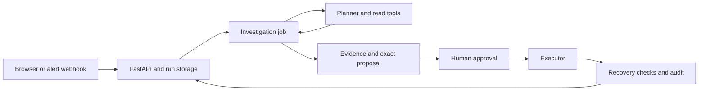

# Architecture

SRE Copilot investigates an incident, proposes one bounded remediation, and lets an operator approve it and inspect recovery. The supported diagnoses are OOM/crash loop, dependency 503, deployment regression and DNS failure. Uncertain cases escalate.

## Investigation

`agent/langgraph_agent.py` coordinates the bounded loop. Retrieval supplies runbook context; Kubernetes, metrics and log tools supply observations. The model proposes hypotheses and next read tools. Deterministic evidence checks and catalog preconditions constrain its decisions. Model errors are recorded with explicit fallback.

`agent/specialists.py` contains ordinary evidence summarizers, not independent LLM agents. Service memory stores owners, dashboards and reviewed historical outcomes; it is context rather than proof of the current cause.

## Approval and execution

The API authenticates the operator, checks action authorization, validates the stored proposal/evidence hash and expiry, and claims a pending approval atomically. `runtime/job_runner.py` executes the stored action without replanning. `executor/service.py` claims each execution ID before an external side effect; duplicate or uncertain requests cannot silently execute again.

The executor is a trusted internal service protected by its shared token. Live Kubernetes writes go through a namespace-limited gateway. Preview performs no writes. Simulation changes only fixture state. GitOps currently produces local change artifacts; it does not merge a remote pull request or observe a delivery controller.

Verification reports configured recovery checks and sampled telemetry. A relative improvement alone is not resolution. Catalog thresholds belong to the demo and must be replaced with service-specific operational criteria.

## Runtime and evaluation

FastAPI serves the native HTML/CSS/JavaScript workbench. No frontend build service is required. Local startup uses SQLite and an in-process queue; the optional Compose profile uses Postgres and Redis.

The evaluation endpoint starts a separate preview benchmark process with an isolated database and mock state. The UI compares profiles and exposes case-level diagnoses and fallback errors. Groundedness validates structured alert/diagnosis claims only; confidence is heuristic. Historical lab results are dated evidence, not a certification of new changes.

## Operational limits

- The local queue and evaluation supervisor belong to one API process. Redis jobs survive while queued, but the current popped-job delivery has no crash recovery.
- An interrupted write can have an uncertain outcome. Inspect actual infrastructure before deciding on another action.
- The supplied Compose credentials and scenario thresholds are for a disposable lab. Host ports bind to loopback by default.
- Broader datasets, independent SRE review and live failure/restart testing are required before production deployment.

See [the project map](../PROJECT_STRUCTURE.md) for file ownership and [the rebuild record](REBUILD.md) for current verification status.
