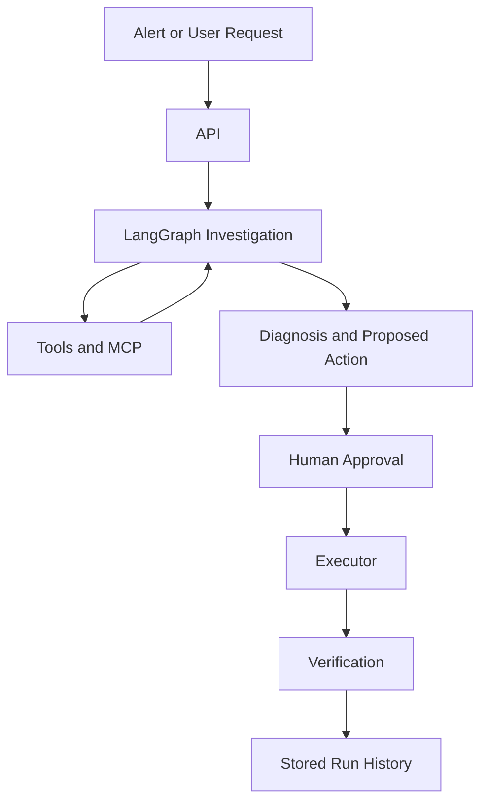

# Simple Architecture

This is the shortest useful explanation of the project.

## What This Project Does

This project is an `AI Assistant for SRE`.

It helps with this flow:

1. an alert or incident comes in
2. the system gathers context
3. it investigates with tools
4. it suggests a likely diagnosis
5. it suggests a safe action
6. a human approves or rejects
7. if approved, it executes
8. it verifies whether the issue improved

That is the whole product.

## Main Flow

```text
Alert/UI
   ->
API
   ->
LangGraph Investigation Flow
   ->
Tools / MCP
   ->
Diagnosis + Proposed Action
   ->
Human Approval
   ->
Executor
   ->
Verification
```

## Tiny Diagram



## The 4 Layers

### 1. Input Layer

Files:
- `ui/app.py`
- `ops/api.py`
- `ops/alert_sources.py`

What it does:
- accepts incidents from the UI
- accepts alerts from Grafana or a generic webhook
- starts a run

Think of this as the front door.

### 2. Investigation Layer

Files:
- `agent/langgraph_agent.py`
- `agent/planner.py`
- `agent/retrieval.py`
- `agent/service_memory.py`
- `agent/specialists.py`
- `agent/evidence_graph.py`

What it does:
- loads incident context
- retrieves runbook and project context
- asks tools for evidence
- ranks likely causes
- proposes the next step

This is the heart of the system.

### 3. Action Control Layer

Files:
- `ops/api.py`
- `ops/auth.py`
- `ops/job_runner.py`
- `executor/service.py`

What it does:
- asks for human approval
- executes approved actions
- records audit and rollback data
- verifies whether the alert recovered

This is the safety layer.

### 4. Memory Layer

Files:
- `ops/storage.py`
- `ops/models.py`
- `agent/service_memory.py`

What it stores:
- runs
- approvals
- execution results
- rollback records
- previous incidents
- service memory
- service history

This is why the system can answer questions about previous runs.

## What Is Service Memory?

`Service memory` is just saved context about a service.

Examples:
- owner team
- dashboards
- recent deploys
- previous incidents
- known patterns

Why it exists:
- so the investigation does not start blind every time
- so investigations have more context
- so previous incidents can help with current ones

Simple definition:

`service memory = background context for a service`

It is not magical memory. It is stored operational context.

## What Are Specialists?

Files:
- `agent/specialists.py`

Right now, specialists are not full independent AI agents.

They are focused analyzers for different evidence types:
- metrics
- logs
- change/deploy context

Each specialist produces a short finding.
Then the system combines them into one coordinator summary.

Simple definition:

`specialists = focused evidence summaries`

They exist so one giant reasoning step does not have to do everything at once.

## What Is The Coordinator Summary?

This is just the merged view of the specialist findings.

Example:
- metrics says error rate is high
- logs say DNS lookups are failing
- change context says no recent deploy happened

Then the coordinator summary says:
- DNS is the strongest current explanation
- logs and metrics support it
- deploy regression looks less likely

Simple definition:

`coordinator summary = one combined investigation explanation`

## What Is AI And What Is Deterministic?

### AI parts

Files:
- `agent/planner.py`

What AI does:
- decide the next investigation step
- decide whether to call another tool
- decide whether to propose an action or escalate

### Deterministic parts

Files:
- `agent/retrieval.py`
- `agent/evidence_graph.py`
- `agent/deterministic_policy.py`
- `ops/job_runner.py`
- executor files

What deterministic code does:
- retrieval
- ranking
- tool execution
- action normalization
- approval checks
- execution
- verification
- audit and storage

Simple rule:

`AI decides`

`deterministic code verifies, stores, and executes safely`

## What To Ignore For Now

If the repo feels too big, ignore these at first:
- integration registry details
- generic alert adapters
- platform overview page
- queue/worker internals

Focus only on this:

1. alert comes in
2. system loads service context
3. planner chooses tools
4. tools return evidence
5. system ranks likely causes
6. system proposes a safe action
7. human approves
8. system verifies recovery

If you understand that flow, you understand the product.

## File Map

If you only want the minimum set of files:

- `ops/api.py`: entrypoint
- `agent/langgraph_agent.py`: main workflow
- `agent/planner.py`: AI reasoning
- `agent/retrieval.py`: context retrieval
- `agent/service_memory.py`: stored service context
- `agent/specialists.py`: focused evidence summaries
- `agent/evidence_graph.py`: evidence ranking and citations
- `ops/storage.py`: saved runs and history
- `executor/service.py`: safe execution

That is the smallest useful reading list.

## Read These 5 Files First

If you want the fastest path to understanding the repo, read only these 5 files first:

1. `ops/api.py`
   - the front door
   - shows how runs are created and how alerts enter the system

2. `agent/langgraph_agent.py`
   - the main investigation workflow
   - shows the full incident flow end to end

3. `agent/planner.py`
   - the AI reasoning step
   - shows where Ollama is used and where fallback happens

4. `agent/retrieval.py`
   - the context and runbook retrieval layer
   - shows how the system finds relevant supporting information

5. `executor/service.py`
   - the safe execution layer
   - shows how approved actions are actually run

If those 5 files make sense, the rest of the repo becomes much easier to place.
